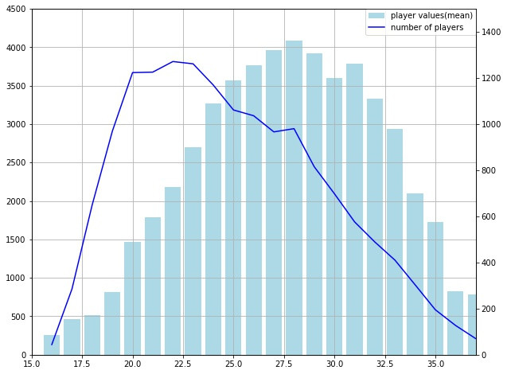
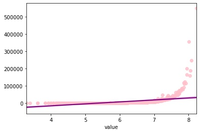

# Project_FIFA_MoneyBall

## The objective and the motive

Football is one of the largest market in sports.
In this analysis, I will try to draw the overview of the market values of players by sorting countries, leagues, and their ages. 
I will also make the linear regression model to predict the market value of a player.

### Three Analysis

Before creating linear regression model, I will analyze the following three questions. 

- Which countries are the origins of high valued players?
- Which clubs have more high valued players?
- When is the football players' career-peak in terms of their values?

### Linear Regression Model
I set the target value as 'value' of the players and try to create best linear regression model.

## Dataset

I used dataset which is provided in the Data folder [**fifa21_male2.csv**](https://github.com/Ironhack-Data-0621-Remote/Project_FIFA_MoneyBall/tree/main/Data) dataset.

I personally used two csv files apart from the main dataset.

### League_rate2.csv
One is 'league_rate2.csv'
I created it extracting data from two website.

To get information which clubs belongs to which leagues 
https://www.ea.com/games/fifa/fifa-21/news/fifa-21-all-leagues-clubs-teams

To get the ranking and values of each leagues including lower divisions
https://www.globalfootballrankings.com/

### best11.csv
The other data file is 'best11.csv' which contains best 55 players selected by FIFA for 2020.
Data was extracted from the following website.

https://fifpro.org/en/industry/world-11/2020-world-11-the-list-of-55-male-players

## Used tools 
For this project, I used Python including following libraries.

- pandas
- matplotlib
- seaborn
- scipy.stats 
- os
- statsmodels.api
- sklearn

## Workflow
I followed the following steps to analyze the data and create linear regression model.

### 1. Importing the data
- 1-1. Importing the data
- 1-2. Getting overview of the data

### 2. Cleaning (columns names, objects to strings, null)
- 2-1. Changing the column names and setting 'ID' column as index
- 2-2. Changing 'height' unit from feet/inches to centimeter
- 2-3. Changing 'weight' unit from pounds to kilograms
- 2-4. Changing 'joined' column type from object into date
- 2-5. Changing data type of 'value' and 'wage' from object to string
- 2-6. Changing 'W/F', 'SM' and 'IR' from object to string
- 2-7. Changing 'a/w' and 'd/w' into scales
- 2-8. Changing 'hits' from object to string
- 2-9. Changing columns 'ls' to 'gk' from object to string
- 2-10. Handling null values
- 2-11. Determine whether the player is active or retired

### 3. EDA
- 3-1. Checking distributions

### 4. Personal Analysis
- 4-1. Which countries are the origins of high valued players?
- 4-2. Which clubs have more high valued players?
- 4-3. When is the football players' career-peak in terms of their values?

### 5. Creating Linear Regression Models
#### 5-1. Transformation
- 5-1-0 Without transformation
- 5-1-1. Box-cox transfomation to 'value'

#### 5-2. Removing some players
- 5-2-1. all active players
- 5-2-2. top club active players¶
- 5-2-3. top club active outfield player

#### 5-3. Change dependent variables
- 5-3-1. 'ova' and 'age'
- 5-3-2. 'ova', 'age' and 'sm'
- 5-3-3. add fifa best 11
- 5-3-4. remove outlier from 'value'

#### 5-4. Overall results of the models

## 6. Analysing Linear Regression Models

## 7. Conclusion

### Persoal Analysis
#### Countries and market values

| nationality	| average value
| --- | ---	
| Brazil	| 6783.866822	
| Spain	| 6482.513465	
| Germany | 	5721.974026	
| Portugal	| 5662.529880
| France | 	5556.868231	
| Italy | 	4615.315615	
| Belgium	| 4603.184080	
| Argentina	| 4514.445983	
| England	| 3455.195418	
| Netherlands	| 3411.867008	

#### Clubs and market values
| club | average value
|	--- |	---	
| FC Bayern München	| 27668.181818
| Real Madrid	| 24693.548387	
| Liverpool	| 21848.974359	
| Paris Saint-Germain	| 21042.500000	
| Manchester City	| 20263.513514	
| FC Barcelona	| 18757.894737	
| Juventus	| 16529.054054
| Atlético Madrid	| 15999.305556	
| Manchester United	| 14935.000000	
| Borussia Dortmund	| 14665.714286

#### Age and market values

### Linear Regression Model
As taking the following steps, the R-squared of the model reached to 0.9735.

[**Cleaning**]
- Filter out retired players
- Filter out goalkeepers
- Filter out players who belongs to lower division

The number of rows decreased to 7048. (In the beginning it was 17125)

[**Transformation**]
- Box-cox transformation to 'value' variable

[**Variables**]
- set dependent variable as 'ova', 'age' and 'sm'
- but not necessary to have 'sm' because it doesn't make a big difference.

| top_league | no trans | box-cox'value' | only active | no gk | 'ova','age' | 'ova','age','sm' | best11 | remove outliers
| ---        | ---      | ---            |   ---       |  ---  |  ---        | ---              | ---    | --- 
|  all       |  0.400   |  0.858         |  0.883      |  -    |  -          |  -               |  -     |  -  
|  top31     |  -       |  -             |  0.899      | 0.911 | 0.965       |  -               |  -     |  -  
|  top18     |  -       |  -             |  0.906      | 0.930 | **0.972**   |  **0.973**       | 0.975  | 0.972
|  top8      |  -       |  -             |  0.906      | 0.935 | 0.968       |  -               |  -     |  - 
|  top5      |  -       |  -             |  0.929      | 0.936 | 0.971       |  -               |  -     |  - 

*Notice*

The best11 has the highest r-squared value, however the coeffecient of best11 was negative, which supposed to be positive. So, I would not take it as the best model.

### Things to consider 

I am little skeptical about my model, because the r-squared is too high...

This model is mostly dependent on 'overall rating' which I do not know how this value was created. If overall rating was made from abilities as well as market value, this model would not work.

